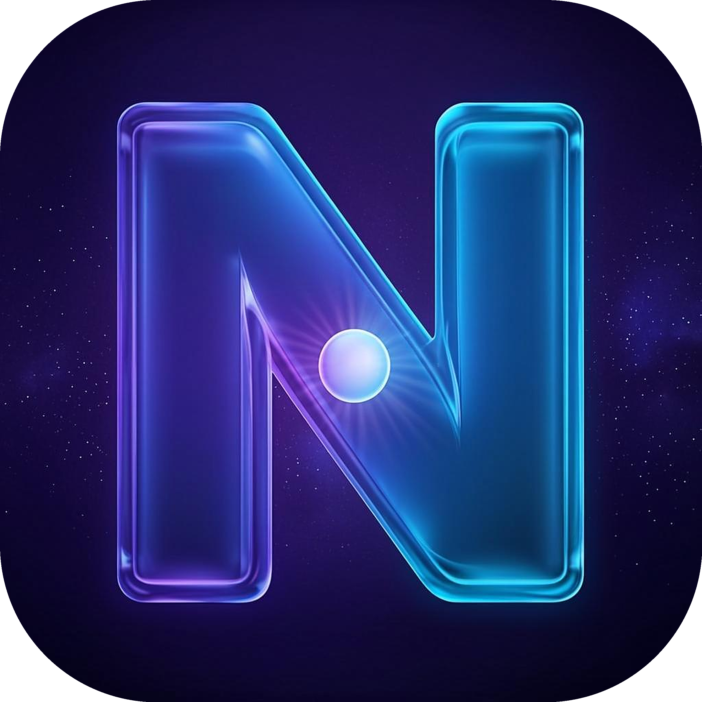

<div align="center">


# Nexus

**A private AI assistant that runs entirely on your phone. Chat with language models fully on-device — no server, no account, no data leaving the device.**

iOS + Android · Built on the MIT-licensed [PocketPal AI](https://github.com/a-ghorbani/pocketpal-ai) (React Native + llama.cpp via `llama.rn`)
</div>

---

## What This Is

This repository is a **white-labeled fork** of PocketPal AI. Store-facing identity, visual branding, and default assistant behavior have been replaced; all inference internals are upstream. Current identity:

| Property | Value |
|---|---|
| App display name | `Nexus` |
| Android `applicationId` (Play Store ID) | `com.nexusai.nexus` |
| iOS bundle ID | `com.nexusai.nexus` |
| Deep-link scheme | `nexus://` |
| Version | `1.18.1` (build 6) |

> **Before releasing:** search-and-replace the placeholder brand — `Nexus`, `nexus-app`, `com.nexusai.nexus`, `nexus://` — with your real brand. All identity tokens are centralized (see table in *Identity Map* below).

## Quick Start (Debug Builds)

Prerequisites: Node 18+, JDK 17, Android Studio (SDK 34/35), Xcode 15+, CocoaPods.

```bash
yarn install                 # JS dependencies (updates yarn.lock root entry)
cd ios && pod install && cd ..

yarn android                 # run on Android device/emulator
yarn ios                     # run on iOS device (Metal) / simulator (CPU-only)
```

First launch: open **Models** tab → search Hugging Face (`your-org/your-model`) → download a GGUF (start with a 0.5–1.5B `Q4_K_M`) → chat.

## Release Builds

### Android

```bash
# 1) create YOUR release keystore (back it up — lost key = lost update channel).
#    Filename and alias are fixed by android/app/build.gradle → signingConfigs.release:
keytool -genkeypair -v -storetype PKCS12 \
  -keystore android/app/nexus-release-key.keystore \
  -alias nexus_key_alias -keyalg RSA -keysize 2048 -validity 10000

# 2) provide the passwords — .env (see .env.example) or the environment:
#    APP_RELEASE_STORE_PASSWORD=...  APP_RELEASE_KEY_PASSWORD=...
#    Without them the build falls back to debug signing.

cd android && ./gradlew bundleProdRelease
# → app/build/outputs/bundle/prodRelease/app-prod-release.aab
```

`versionCode` / `versionName` live in `android/app/build.gradle`.

### iOS

```bash
cd ios && pod install
open PocketPal.xcworkspace    # target name kept as 'PocketPal' by design (build-internal)
```

1. Target → Signing & Capabilities → your team + bundle ID `com.nexusai.nexus`.
2. `Product → Archive` → Distribute App. Archive on a **real device** at least once (simulators never exercise Metal).

#### iOS application file (`.ipa`) via CI

A ready-made Apple release job lives at `release/ios-release.yml`. GitHub
only runs workflows from `.github/workflows/`, so activate it with:

```bash
git mv release/ios-release.yml .github/workflows/ios-release.yml
git commit -m "chore(ci): activate iOS release workflow" && git push
```

Once active, every version tag (`v*`) attaches `Nexus-<tag>.ipa` to the
same GitHub Release as the Android APK/AAB.

The built IPA is **unsigned** (built with `CODE_SIGNING_ALLOWED=NO` because
distribution certificates live outside this repo) and installs on real
iPhones/iPads with [AltStore](https://altstore.io),
[Sideloadly](https://sideloadly.io), or TrollStore — the sideloading tool
re-signs it for the device. Requires iOS 15.1+; Metal acceleration needs
iOS 18+.

App Store / TestFlight still requires a local archive with your Apple
Developer credentials, per the steps above.

## Staying up to date

Devices that already installed Nexus are told when a newer build is out:
after startup (at most once a day) the app checks this repository's
latest GitHub Release and shows a one-tap **update dialog** with a direct
link to the new APK (Android) / IPA (iOS). A manual check lives under
**About → Updates → Check for updates**, and users can skip a specific
version if they prefer not to be reminded of it again.

## Identity Map (what was rebranded vs. kept)

**Replaced (store-facing / user-visible):**
- `app.json` → `Nexus` · `package.json` → `nexus-app`
- `android/app/build.gradle` → `applicationId com.nexusai.nexus`, versions reset
- `android/app/src/main/res/values/strings.xml` → `app_name`
- `android/app/src/main/AndroidManifest.xml` → deep-link schemes → `nexus://`
- `ios/PocketPal/Info.plist` → `CFBundleDisplayName` / `CFBundleName` / URL scheme
- `ios/PocketPal.xcodeproj/project.pbxproj` → `PRODUCT_BUNDLE_IDENTIFIER` (+ tests target), `MARKETING_VERSION 1.18.1`, `CURRENT_PROJECT_VERSION 6`
- `ios/PocketPal/PocketPal.entitlements` → keychain group re-scoped to new bundle ID
- All `pocketpal://` deep-link routes in JS/Kotlin/Swift (parser: `src/services/hubRunLink.ts`; checkout callback scheme in `src/store/CheckoutFlowStore.ts`; Siri intents in `ios/PocketPal/AppIntents/`)
- Root component name aligned with `app.json`: `MainActivity.getMainComponentName()` (Android) and `AppDelegate.startReactNative(withModuleName:)` (iOS) → `Nexus`
- Launch screen label (`ios/PocketPal/LaunchScreen.storyboard`)
- Permission prompts (`ios/PocketPal/Info.plist` usage descriptions)
- Product name in all 18 locale files (`src/locales/*.json`)
- Database name `nexus` (`src/database/index.ts` ↔ `ios/PocketPal/AppIntents/PalDataProvider.swift` ↔ `android/app/src/main/res/xml/backup_rules_legacy.xml`)
- Keychain / AsyncStorage namespaces (`nexus-server-*` in `src/store/ServerStore.ts`, `@nexus/*` in `src/store/FeedbackStore.ts`)
- Outbound user agents (`src/utils/hfUserAgent.ts`, `DownloadWorker.kt`) → `Nexus/<version>`
- Launcher icons: `mipmap-*` (5 densities + round) and `AppIcon.appiconset` (12 sizes)
- In-app/README logos: `src/assets/pocketpal-*.png` (filenames kept)
- Default chat-template system prompts (`src/utils/chat.ts`)
- Store metadata (`fastlane/metadata/`), CI workflow package refs
- Legal docs: `PRIVACY_POLICY.md`, `TERMS_OF_SERVICE.md` (linked from the About screen)

**Intentionally kept (build-internal, renaming them risks breaking compilation):**
- Kotlin namespace `com.pocketpal` + source dir `com/pocketpalai/` (matches upstream gradle `namespace`)
- RN New-Architecture codegen name `PocketPalSpecs` (`package.json → codegenConfig`)
- Xcode project/target name `PocketPal` (paths, scheme, entitlements filename)
- npm packages `@pocketpalai/llama.rn`, `@pocketpalai/react-native-speech` (published dependency names)

Users never see any of the above; changing them is optional hygiene (see the [white-label guide](docs/white_labeling.md) §2.2 Step 4 — it also covers architecture, model packaging, and the full build/verification checklist).

## Ship Your Own Model

- **Nexus catalog (built-in):** the Models tab recommends the **Nexus lineup** (Nexus 1.0 → 3.5) automatically matched to device RAM, including capable 4 GB–5 GB models (Nexus 3.1–3.5) for advanced offline reasoning, coding, and problem solving. Names/entries live in `src/store/bundledDeviceRules/rules.<platform>.json`; see **models/README.md** for the full table.
- **Release models on GitHub (automated):** drop `.gguf` files into `models/`, run **Actions → Model Release** → they publish as versioned GitHub Release assets (`models-vX.Y`). The workflow enforces the 2 GiB-per-asset limit.
- **Online rules override:** the app refreshes its catalog from `nexus-ai-official/nexus-device-rules` (via jsDelivr). Fork the upstream rules repo, rename entries, push — until then the bundled Nexus catalog is used (fetch failures fall back gracefully).
- **Pre-bundle a model:** iOS — add `.gguf` to the Xcode target and copy from `RNFS.MainBundlePath` at first run. Android — `android/app/src/main/assets/models/` + `RNFS.copyFileAssets(...)`. Mind Google Play's ~200 MB base-module limit.
- **Sizing:** 4 GB devices → ≤1 GB `Q4_K_M`, `n_ctx: 2048`; 8 GB → 3–4B; 12 GB+ → 7–8B. Defaults live in `src/store/ModelStore.ts`.

## Automated Releases (GitHub Actions)

| Workflow | Trigger | Produces |
|---|---|---|
| `Android Release (APK + AAB)` (`release.yml`) | push tag `v*` or manual run | Signed **APK + AAB** attached to a GitHub Release |
| `iOS Release (IPA)` (`release/ios-release.yml`) | push tag `v*` once moved into `.github/workflows/` | Unsigned **IPA** attached to the same GitHub Release |
| `Model Release` | manual run (version input) | **Model pack** attached to a GitHub Release |

**APK release flow:** push a tag → Actions builds → Release page gets `Nexus-vX.Y.Z.apk`:

```bash
git tag v1.0.0 && git push origin v1.0.0
```

Signing secrets (optional — builds fall back to debug signing without them):
`ANDROID_KEYSTORE_BASE64` (keystore created with `-alias nexus_key_alias`, the alias
is pinned in `android/app/build.gradle`), `ANDROID_STORE_PASSWORD`, `ANDROID_KEY_PASSWORD`.
Optional: `GOOGLE_SERVICES_JSON` (real Firebase config; a dummy is used otherwise).

## Upstream Sync

```bash
git remote add upstream https://github.com/a-ghorbani/pocketpal-ai.git
git fetch upstream && git cherry-pick <commit>   # pull upstream bug fixes selectively
```

## License

Upstream code is MIT (see `LICENSE`) — keep the notice. **Model licenses are separate**: verify your GGUF's license (Gemma, Llama, Qwen families each have their own terms) before distribution.
